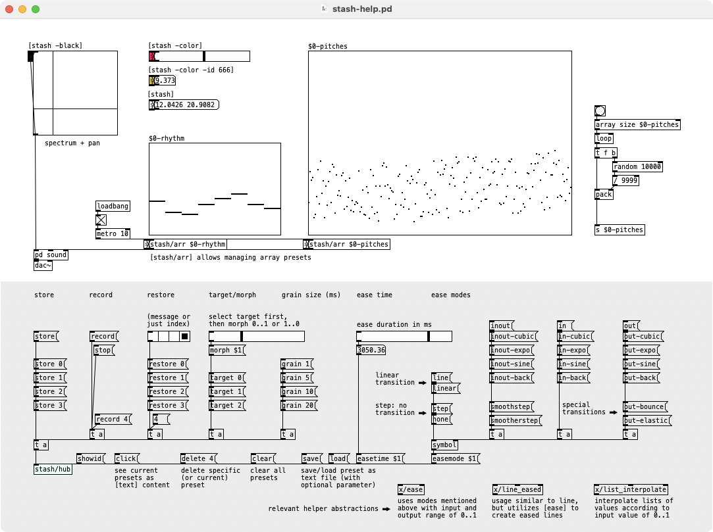
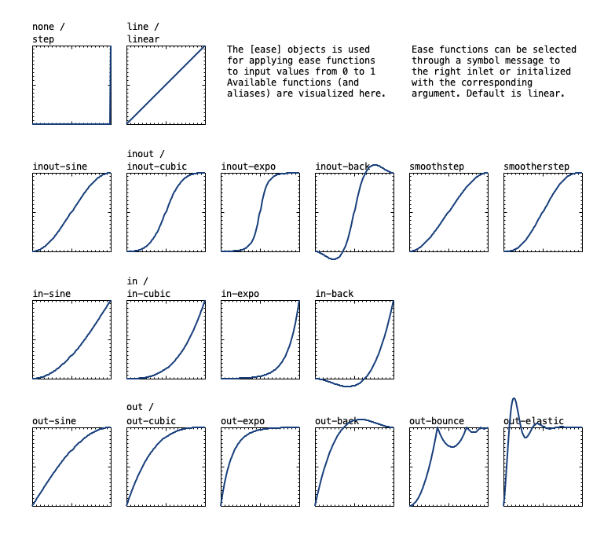

# [stash/hub] + [stash]
Puredata (Pd) abstractions for preset management, based on central [stash/hub] and small [stash] plugin objects

## Requirements
* requires `iemguts` library (available via `Deken`)

## Usage
* connect [stash] objects to any number of objects to store and restore their values (connections are made via "cross-connecting" - inlet->outlet, outlet->inlet)
* create a central [stash/hub] to control presets (store, restore, record, stop, save, load, ease, moprh, etc.)
* an additional [stash/arr <array_name>] object can be used to store and restore array values

## Features
* handles all objects that output their state on `bang` input
* save / load preset files
* store (and restore) arbitrary amount of preset states
* ease states with a variety of ease functions
* morph between states with float input (0..1 or 1..0 - depending on start value)
* record and play back value changes instead of single preset snapshots
* additional helper object [stash/arr] facilitates management of array values
* custom color and id definitions for [stash] objects

See help of [stash] object for example application.

# Flags and messages
## [stash]
### creation arguments
* `-color (black, #<hexcode>)` to set the color:
  * color will be generated based on id if no argument is given
  * `-color black` will create a black object (this can also be achieved by just setting the `-black` flag)
  * you can set any hexadecimal value - e.g. `-color #ddff22`
* `-id <id>`, `<float>` or `<symbol>` to manually set id via flag or simply by adding a float or symbol argument
* `-noease` to avoid easing of values (will directly switch to target value)
* `-debug` to output id on creation

## [stash/hub]
### messages (can also be set as creation arguments)
* `<float>` to restore preset of given id (snapshot or recording). if no preset is present, the id is selected (to store or record into)
* `restore <id>` to restore preset of given id
* `target <id>` to set target id for `morph` interaction
* `morph <float`> to morph to target state with float input of values `0..1` morph can go in both directions, dependet on whether 0 or 1 is first registered value
* `store (<id>)` to store values to given id (or to selected id if no argument is given)
* `load (<filename>)` to load presets from file (or via file selection through openpanel if no argument is given)
* `save (<filename>)` to save presets to file (or via file selection through savepanel if no argument is given)
* `delete (<id>)` to delete presets at given id (or selected id if no argument is given)
* `click` or `edit` to display preset data in [text] dialog (should not be edited there due to Pd bug when displaying and storing data with escaped `\,` and `\;`)
* `clear` to clear all presets
* `record (<id>)` to start recording to given id (or to selected id if no argument is given)
* `stop` to stop recording (or playback)
* `showid (<0/1>)` to display [stash] ids next to objects
* `grain <float>` to set grain size for easing in ms (default is 20, since this is based on Pd's [line])
* `easetime <float>` to set ease duration in ms
* `easemode <mode>` to set ease mode (see functions below)

### ease functions
* see abstraction help patch `x/ease-help.pd`

## Mechanism
* when creating a [stash] object, it will self-assign its id and then check among other [stash] objects in the patch whether the id is unique. it will repeat this process with random ids in a range of `0..999'999` until it finds a unique id (which in most cases should be instantly)
* when storing a preset with [stash/hub], all [stash] objects get a `store` message, output a bang on their outlet and send back the numbers they receive from their inlet to [stash/hub] together with their id
* easing and morphing are handled in the [stash] objects based on the messages they receive
