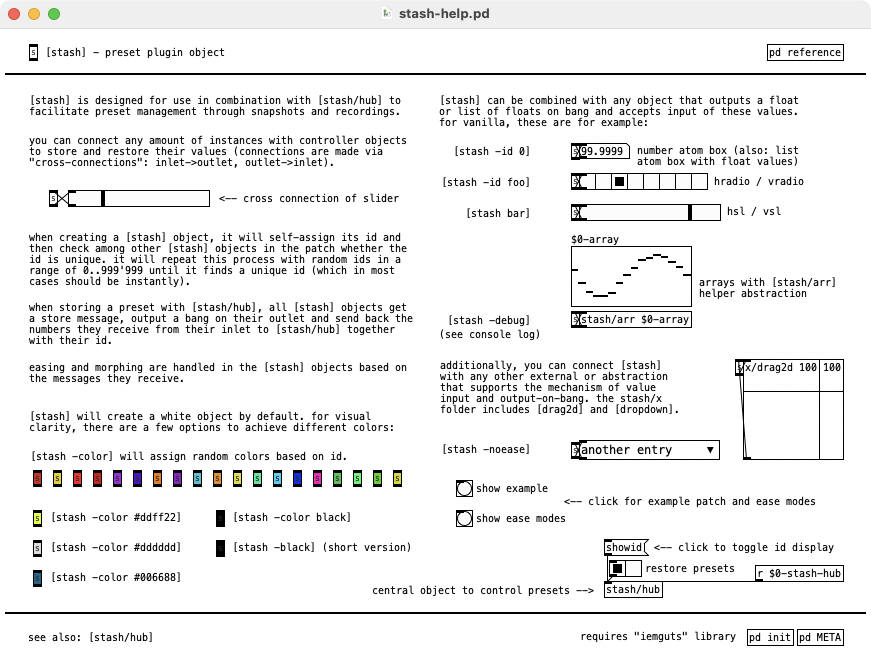

# [stash/hub] + [stash]
Puredata (Pd) abstractions for preset management, based on central [stash/hub] and small [stash] plugin objects

## Requirements
* requires `iemguts` library (available via `Deken`)

## Usage
* connect [stash] objects to any number of objects to store and restore their values (connections are made via "cross-connecting" - inlet->outlet, outlet->inlet)
* create a central [stash/hub] to control presets (store, restore, record, stop, save, load, ease, fade, etc.)
* an additional [stash/arr <array_name>] object can be used to store and restore array values

## Features
* handles all objects that output their state on `bang` input
* save / load preset files
* store (and restore) arbitrary amount of preset states
* ease states with a variety of ease functions
* morph between states with float input (0..1 or 1..0 - depending on start value)
* record and play back value changes
* additional helper object [stash/arr] facilitates management of array values
* optional argument to create black or randomly colored plugins (`-black` or `-color` based on id) 
* manually set id via `-id <number>` argument or simply by adding a float argument

see help of [stash] object for example application.

## Mechanism
* when creating a [stash] object, it will self-assign its id and then check among other [stash] objects in the patch whether the id is unique. it will repeat this process with random ids in a range of `0..999'999` until it finds a unique id (which in most cases should be instantly)
* when storing a preset with [stash/hub], all [stash] objects get a `store` message, output a bang on their outlet and send back the numbers they receive from their inlet to [stash/hub] together with their id
* easing and morphing are handled in the [stash] objects based on the messages they receive
